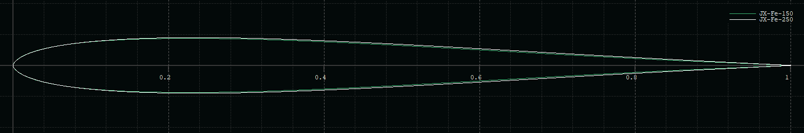
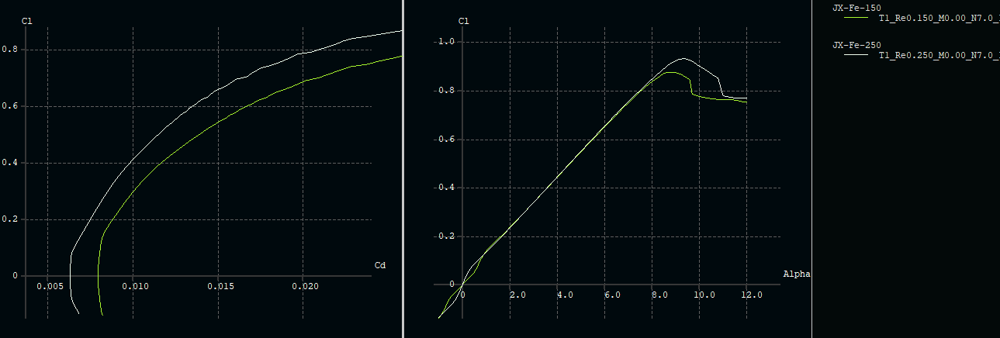

<!-- PROJECT LOGO -->

# JX-Fe
Symmetrical airfoil family for tailplane or fin with low drag and small dead band.

### Description

The airfoils were designed using [Xoptfoil-JX](https://github.com/jxjo/Xoptfoil-JX/) with the focus on low drag, small dead band and a robust alpha max. 

| Airfoil      | Thickness       | Remarks        | 
| :---         |     :---        |   :---         |  
| JX-Fe-250    | 7.2% at 23.2%   | used at root   |  
| JX-Fe-150    | 7.0% at 22.3%   | used at tip    |  

Comparsion of the two airfoils in a typical Reynolds situation:

### License
Unless otherwise noted, these files are licensed under the Creative Commons [Attribution-ShareAlike 4.0 International](https://creativecommons.org/licenses/by-sa/4.0/) (CC BY-SA 4.0) license.

