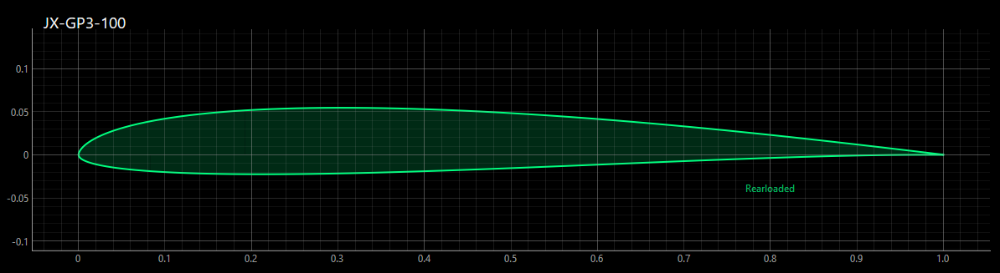
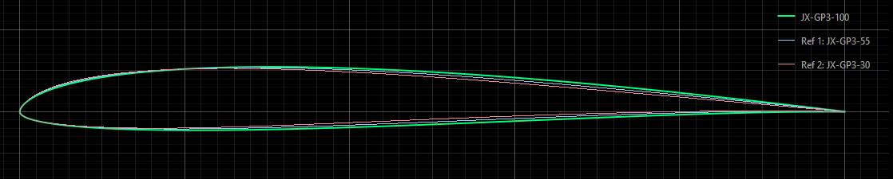
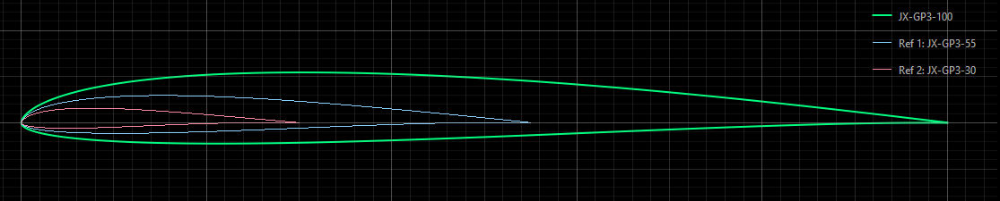
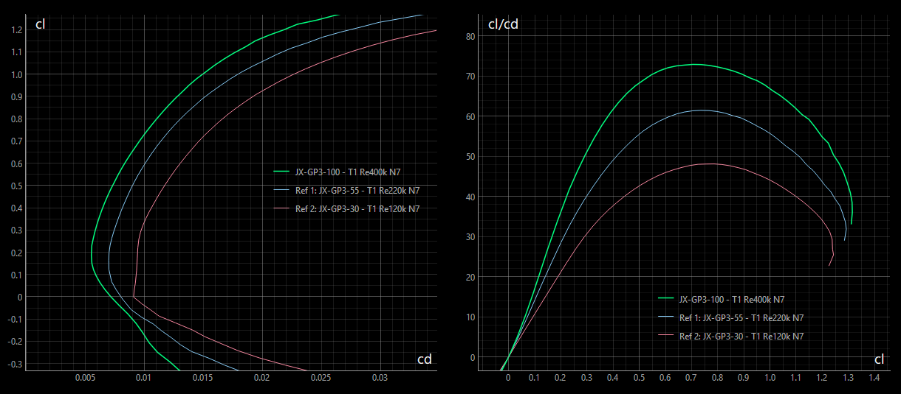
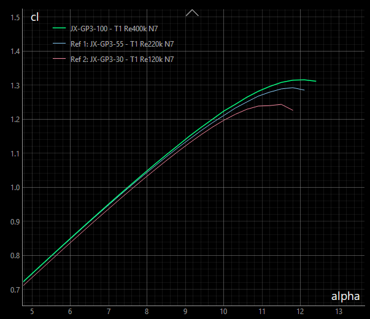

<!-- PROJECT LOGO -->

# JX-GP3

The JX-GP airfoil family (or 'strak') was designed for F3F style slope gliders focusing on medium to light flying conditions.
Due to its fine allround capabilities, the airfoil family can also be used for F3B wings or leisure flying.

The strak can be applied for wings having a wing span from 1.5m to 3.5m. Used at the right wing section
a harmonious distribution of lift, drag and moment will be achieved. 
Flaps are recommended to achieve best performance.

All airfoils were generated by Xoptfoil2 as the airfoil optimizer. 

#### Characteristics 

Main aerodynamic characteristics of JX-GP3 are …

- low minimum drag at around cl=0.2
- designed for no flap deflection at medium glide speed
- high alpha_max and cl_max
- broad Reynolds range with a respectable performance at lower Reynolds numbers 

Wings based on JX-GS show in practice …

- good glide and thermal capabilties (set +1° to +3° flaps)
- fine acceleration with a remarkable high speed 
- high maximum lift for narrow turns
- well behaved flight properties

#### Design History 

The airfoil was designed for the F3F glider VJX.glide which is an extension design to the original VJX for medium to light conditions. The design of VJX.glide and the JX-GP airfoil family is documented in detail on [RC-Network](https://www.rc-network.de/threads/projekt-vjx-glide.11961376/). 

In 2025 an overall revision was made. Bézier curves were used in optimization to achieve fine geometric properties. The aerodynamic objective in this revision was mainly to align both alpha_0 and cl_max along the airfoil family. The revision led to version 3 of the strak, which is called **JX-GP3**.

## The Airfoil Family

The airfoil family consists of 3 airfoils each of them optimized within their individual Reynolds profile to have consistent aerodynamic properties over the wing span.

The 3 airfoils scaled to their corresponding position with a wing.

### Nomenclature and Blending

The suffix number in the airfoil name indicate the suggested chord position along the wing span. 
If, for example, JX-GP3-100 is taken as the airfoil at root of wing having a chord of 240mm, then JS-GP-55 is placed at the wing section having a chord of 55% - that is 127mm.

The airfoils can be 'blended' - e.g. using the [AirfoilEditor](https://github.com/jxjo/AirfoilEditor) - to create intermediate airfoils: Blending JX-GP3-100 with 33% JX-GS3-55 will result in the new airfoil JX-GS3-85. The polar of such a blended airfoil will be relative between the polars of its parent airfoils without lost of aerodynamic properties. 

### Airfoils of the Family  

Each airfoil was optimized based on a main polar, which is defined by a 'Design Re', Xfoil polar Type 1 and Ncrit =7.
An additional objective was to achieve good properties at half of the Design Reynolds number. 

| Airfoil      | Design Re | Re Range     | Thickness    | Camber      | Remarks     
| :---         |  :---:    |  ---:        | :---:        |  :---:      | :---                           |
| JX-GP3-100   | 400k      | 200k - 600k  | 7.7% at 27%  | 1.7% at 40% |  Master airfoil                |
| JX-GP3-50    | 220k      | 100k - 350k  | 7.4% at 25%  | 1.7% at 37% |  extends to lower Reynolds     |
| JX-GP3-30    | 120k      | 50k - 200k   | 7.2% at 22%  | 1.8% at 36% |  Tip airfoil                   |

To give an indication for air speed: Having a chord of 230mm at Reynolds number of 400.000 equals to an air speed of about 25m/s 

The 2 airfoils JX-GP3-100 and JX-GP3-55 cover the performance span range of the wing. Each of this airfoils is optimized for best performance according to the objectives. 

Special attention was paid to the lower Reynolds airfoil JX-GS3-55 that it keeps up regarding alpha_max (cl_max). This results in good lift reserves at the outer wing and allows a planform closer to elliptical.

The main design objective of the tip airfoil JX-GP3-30 is to preserve the wing tip when it comes to high alpha. Although not being in the foucs of the design, this airfoil (if necessary blended with JX-GP3-55) can be used for very small gliders with a wing span of 1.5m.

### Remarks on the Design

In flight the airfoils will operate at realtivly low Reynolds numbers. Espcially JX-GP3-55 and JX-GP3-30 will enter RE 200k and below where laminar separation bubbles become more and more dominant. 

Therefore the upper side of the airfoil got 'bubble ramp' characteristics with a gentle deceleration of the flow. 
While this results in a slight reduction in performance in terms of glide ratio at higher RE values, the slower flight and acceleration capabilities benefit from this approach.

On the lower side of airfoil there is a curvature reversal which results in a 'rearloaded' airfoil. Rearloading improves the mid and high lift properties of an airfoil. On the other side the laminar-turbulent point of transition is moved towards the leading edge for low angles of attack. This leads to a significant increase of cd at low cl, where the lower side of the airfoil becomes more and more dominant. The amount of rearloading was therefore balanced with the objective of good acceleration and high speed flying capabilities.   

### Polars 

Designed for fast flying, the airfoils have their cd_min at moderate low cl=0.2. The main polar characteristics are kept along the airfoils. 

The diagrams show the polars of the airfoils with their individual Design Reynolds number.

The airfoils are optimized to have a congruent cl(alpha) polar. Because of this the camber of the airfois is increasing a little bit towards as the Design Reynolds number is decreasing. 

The tip airfoil JX-GS3-30 may have a lower alpha_max due to the higher induced angle at tip. 

<!---
### Calculation of Re*Sqrt(cl)
The value of Re*Sqrt(cl), which equals to the fixed lift T2 polar, can be easly calculated with the approximation formula

`Re*Sqrt(cl) = 900 * l * sqrt(Ws)` with `l  chord length [cm]` and `Ws wing load    [g/dm²]`

Example: 
A wing with a wing load of 70 g/dm² will have at chord length 20cm a value of:
Re*sqrt(cl) = 900 * 20 * sqrt(70) = 150000.
So airfoil JX-GS-15 would be a good choice at this section.  
--->

### Installation

Download the zip-file including the three airfoils and this README as pdf.

### License
Unless otherwise noted, these files are licensed under the Creative Commons [Attribution-ShareAlike 4.0 International](https://creativecommons.org/licenses/by-sa/4.0/) (CC BY-SA 4.0) license.

