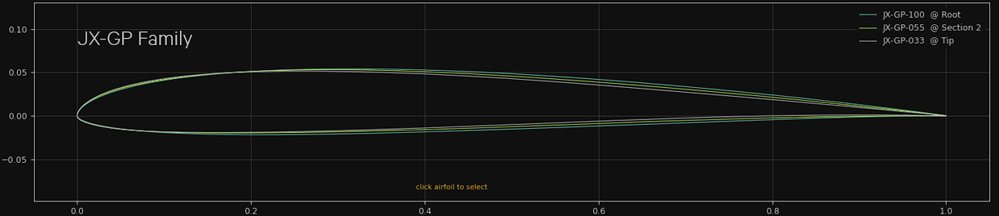

<!-- PROJECT LOGO -->

# JX-GP
Airfoil family for high perfomance F3F/F3B style slope gliders in medium to low conditions

### Description

The airfoils were designed using [Xoptfoil-JX](https://github.com/jxjo/Xoptfoil-JX/) with the focus on best performance in a cl range of 0.1 to 0.5.
Because of the relative small camber value, the usage of flaps is adviced to achieve full performance.

The airfoil family allows to design a complete wing typically in a span range of 1.8m-3.2m. The span position of an airfoil can be calculated via the the design Reynolds number at the wing section

| Airfoil      | Thickness       | Camber         | Design Reynolds | Remarks |
| :---         |     :---        |   :---         |  ---:           |   :--- |
| JX-GP-100    | 7.50% at 27.8%  | 1.71% at 40.2% |  300k-400k      | main airfoil |
| JX-GP-055    | 7.20% at 25.8%  | 1.75% at 35.7% |  160k-230k      | end of performance range
| JX-GT-033    | 7.00% at 22.9%  | 1.71% at 35.3% |  100k-140k      | tip airfoil |

This diagram shows typcical size ratios of wing sections equipped with the airfoils.

Towards the upper end of their Reynolds Design Range the airfoils are optimized for a cl-range around cl=0.15:  

At the lower end of their Reynolds Design Range the airfoils are optimized for a cl-range around cl=0.22:  

### Usage example 

The airfoil family is used in the project 'VJX.glide'. Some background infos about this project and the design of the JX-GP family can be found on [RC-Network](https://www.rc-network.de/threads/projekt-vjx-glide.11961376/) (sorry, in German). 

### License
Unless otherwise noted, these files are licensed under the Creative Commons [Attribution-ShareAlike 4.0 International](https://creativecommons.org/licenses/by-sa/4.0/) (CC BY-SA 4.0) license.

