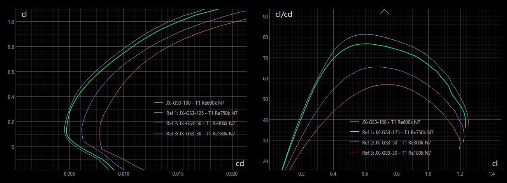
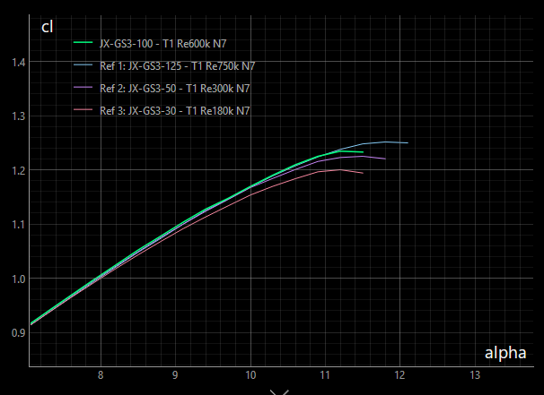

<!-- PROJECT LOGO -->

# JX-GS3

The JX-GS airfoil family (or 'strak') is designed for *very fast* F3F style slope gliders. 

The strak can be applied for wings having a wing span from 2m to 4m. Used at the right wing section
a harmonious distribution of lift, drag and moment will be achieved. 
Because of the small camber value, flaps are mandatory to achieve best performance.

All airfoils were generated by Xoptfoil2 as the airfoil optimizer. 

#### Characteristics 

Main aerodynamic characteristics of JX-GS3 are …

- low minimum drag at about cl=0.1
- designed for no flap deflection at high speed
- still remarkable alpha_max
- broad Reynolds range with a respectable performance at lower Reynolds numbers 

Wings based on JX-GS show in practice …

- high maximum speed
- greed for acceleration
- well behaved flight properties
- having flaps set, nice, not super, slow flight and thermal capabilities 

#### Design History 

The airfoil was originally designed as part of the VJX F3F project. Its development is documented in detail on [RC-Network](www.rc-network.de/threads/entwicklung-eines-f3f-profils.787618). 

The first revision was made in 2023 to increase maximum lift for narrow turns and a slightly improved drag in the cl-range 0.2 – 0.4. This new JX-GS2 family is used in the F3F model VJX.race which was released in 2025.

In 2025 a fundamental revision was made. Bézier curves were used in optimization to achieve fine geometric properties. The aerodynamic objective in this revision was mainly to align both alpha_0 and cl_max along the airfoil family. The revision led to version 3 of the strak, which is called **JX-GS3**.

## Description

The airfoil family consists of 4 airfoils each of them optimized within their individual Reynolds profile to have consistent aerodynamic properties over the wing span.

The 3 airfoils scaled to their corresponding position with a wing.

### Nomenclature and Blending

The suffix number in the airfoil name indicate the suggested chord position along the wing span. 
If, for example, JX-GS3-100 is taken as the airfoil at root of wing having a chord of 240mm, then JS-G3-50 is placed at the wing section having a chord of 50% - that is 120mm.

The airfoils can be 'blended' - e.g. using the [AirfoilEditor](https://github.com/jxjo/AirfoilEditor) - to create intermediate airfoils: Blending JX-GS3-100 with 40% JX-GS3-50 will result in the new airfoil JX-GS3-80. The polar of such a blended airfoil will be relative between the polars of its parent airfoils without lost of aerodynamic properties. 

### Airfoils of the Family  

Each airfoil was optimized based on a main polar, which is defined by a 'Design Reynolds', Xfoil polar Type 1 and Ncrit =7.
An additional objective was to achieve good properties at half of the Design Reynolds number. 

| Airfoil      | Design Re | Re Range     | Thickness    | Camber      | Remarks     
| :---         |   :---    |  :---        | :---         |  :---       | :---                           |
| JX-GS3-125   | 750k      | 400k - 1000k | 8.2% at 32%  | 1.5% at 39% |  extends to higher Reynolds    |
| JX-GS3-100   | 600k      | 300k - 800k  | 7.6% at 30%  | 1.5% at 39% |  Master airfoil                |
| JX-GS3-50    | 300k      | 100k - 400k  | 7.4% at 26%  | 1.6% at 38% |  extends to lower Reynolds     |
| JX-GS3-30    | 180k      | 50k - 250k   | 7.3% at 24%  | 1.7% at 34% |  Tip airfoil                   |

To give an indication for air speed: Having a chord of 230mm at Reynolds number of 600.000 equals to an air speed of about 38m/s 

The 3 airfoils JX-GS3-125, JX-GS3-100 and JX-GS3-50 cover the performance span range of the wing. Each of this airfoils is optimized for best performance according to the objectives. 

Special attention was paid to the lower Reynolds airfoil JX-GS3-50 that it keeps up regarding alpha_max (cl_max). This results in good lift reserves at the outer wing and allows a planform closer to elliptical.

The main design objective of the tip airfoil JX-GS3-30 is to preserve the wing tip when it comes to high alpha. As a standalone airfoil for low Reynolds numbers it is not recommended.

### Polars 

Designed for high speed flying, the airfoils have their cd_min at quite low cl=0.1. The main polar characteristics are kept along the airfoils. 

The diagrams show the polars of the airfoils with their individual Design Reynolds number.

The airfoils are optimized to have a congruent cl(alpha) polar. Because of this the camber of the airfois is increasing a little bit towards as the Design Reynolds number is decreasing. 

The tip airfoil JX-GS3-30 may have a lower alpha_max due to the higher induced angle at tip. 

<!---
### Calculation of Re*Sqrt(cl)
The value of Re*Sqrt(cl), which equals to the fixed lift T2 polar, can be easly calculated with the approximation formula

`Re*Sqrt(cl) = 900 * l * sqrt(Ws)` with `l  chord length [cm]` and `Ws wing load    [g/dm²]`

Example: 
A wing with a wing load of 70 g/dm² will have at chord length 20cm a value of:
Re*sqrt(cl) = 900 * 20 * sqrt(70) = 150000.
So airfoil JX-GS-15 would be a good choice at this section.  
--->

### Installation

Download the zip-file including the three airfoils and this README as pdf.

### License
Unless otherwise noted, these files are licensed under the Creative Commons [Attribution-ShareAlike 4.0 International](https://creativecommons.org/licenses/by-sa/4.0/) (CC BY-SA 4.0) license.

