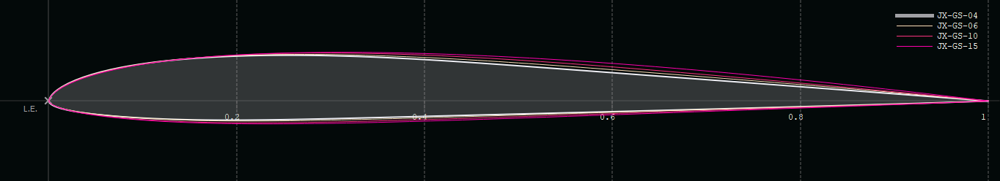

<!-- PROJECT LOGO -->
 

  

# JX-GS
Airfoil famiily for fast F3F style slope gliders

| Airfoil      | Thickness      | Camber         | Re*Sqrt(cl) |
| :---:        |     :---       |   :---         |  ---:       |
| JX-GS-15     | 7.6% at 27,7%  | 1.46% at 40.0% |  150k       |
| JX-GS-10     | 7.4% at 26.8%  | 1.47% at 36.1% |  100k       |
| JX-GS-06     | 7.1% at 25.0%  | 1.47% at 32.3% |   60k       |
| JX-GS-04     | 6.9% at 23.9%  | 1.48% at 30.7% |   40k       |

### License
Unless otherwise noted, these files are licensed under the Creative Commons [Attribution-ShareAlike 4.0 International](https://creativecommons.org/licenses/by-sa/4.0/) (CC BY-SA 4.0) license.

