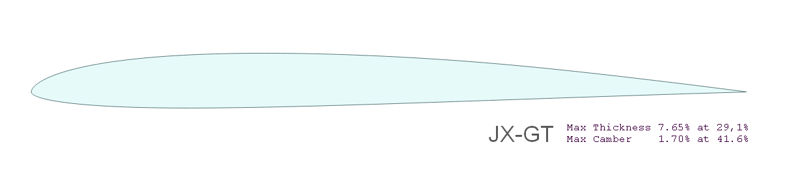
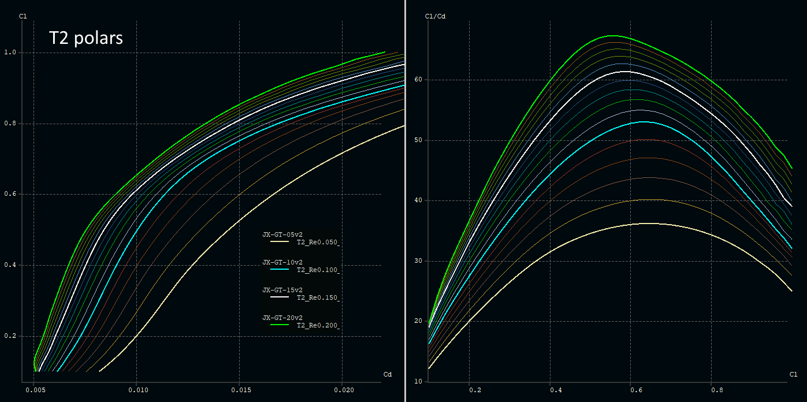

<!-- PROJECT LOGO -->

# JX-GT
Airfoil family for high perfomance F3F/F3B style slope gliders

### Description

The airfoils were designed using [Xoptfoil-JX](https://github.com/jxjo/Xoptfoil-JX/) with the focus on best performance in a cl range of 0.1 to 0.5.
Because of the relative small camber value, the usage of flaps is adviced to achieve full performance.

The airfoil family allows to design a complete wing typically in a span range of 2m-3.5m. The span position of an airfoil can be calculated via the the design value of RE*Sqrt(cl).

| Airfoil      | Thickness       | Camber         | Re*Sqrt(cl) |
| :---         |     :---        |   :---         |  ---:       |
| JX-GT-20v2   | 7.90% at 30.2%  | 1.70% at 41.6% |  200k       |
| JX-GT-15v2   | 7.65% at 28.8%  | 1.70% at 41.6% |  150k       |
| JX-GT-10v2   | 7.30% at 28.0%  | 1.70% at 38.2% |  100k       |
| JX-GT-05v2   | 7.00% at 23.9%  | 1.72% at 35.4% |   50k       |

(in January 2023 the airfoils were slightly revised leading to version v2)

The subdirectory [strak](strak/) includes more airfoils in steps of Re*sqrt(cl)=10.000 which were generated by 'blending' the above main airfoils. 

The airfoils cover 'smoothly' a wide range of Re*sqrt(cl) from 200k down to 50k:

More polars can be found in the [images](images/) subdirectory.

Background infos on the design of the JX-GT family can be found on [RC-Network](https://www.rc-network.de/threads/jx-gt-strak-f%C3%BCr-schnelle-hang-segler.11894434/) (sorry, in German).

### Calculation of Re*Sqrt(cl)
The value of Re*Sqrt(cl), which equals to the fixed lift T2 polar, can be easly calculated with the approximation formula

`Re*Sqrt(cl) = 900 * l * sqrt(Ws)` with `l  chord length [cm]` and `Ws wing load    [g/dm²]`

Example: 
A wing with a wing load of 70 g/dm² will have at chord length 20cm a value of:
Re*sqrt(cl) = 900 * 20 * sqrt(70) = 150000.
So the main airfoil JX-GT would be a good choice at this section.  

### Change log 

Version v2: 

- tip airfoil JX-GT-05v2 with smoother polar at low cl and improved high cl behavior
- main airfoil JX-GT-15v2 with smoother high cl polars (there was an artefact close to LE) 

### License
Unless otherwise noted, these files are licensed under the Creative Commons [Attribution-ShareAlike 4.0 International](https://creativecommons.org/licenses/by-sa/4.0/) (CC BY-SA 4.0) license.

