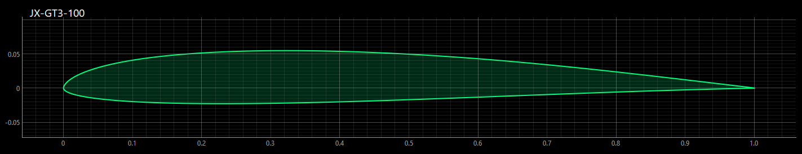
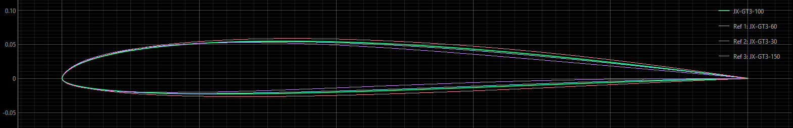
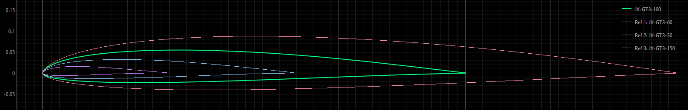
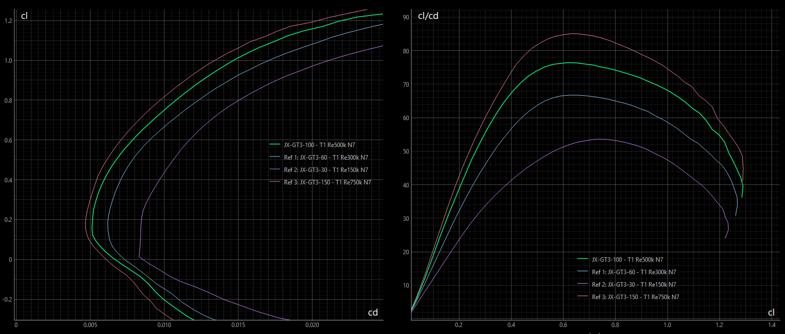
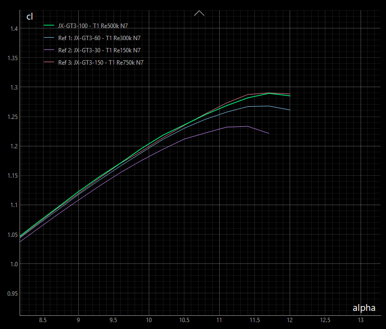

<!-- PROJECT LOGO -->

# JX-GT3

The JX-GT airfoil family (or 'strak') was originally designed as a multi purpose F3F airfoil with a focus on the mid range with flight times between 40s and 50s. 

Due to its balanced properties it can be used in F3B as well as for fast leisure gliders. 

The strak can be applied for wings having a wing span from 2m to 4m. Used at the right wing section
a harmonious distribution of lift, drag and moment will be achieved. 
Having a quite low camber value, flaps are advised to achieve best performance.

All airfoils were generated by [Xoptfoil2](https://github.com/jxjo/Xoptfoil2) as the airfoil optimizer and the [AirfoilEditor](https://github.com/jxjo/AirfoilEditor) as the workbench. 

#### Characteristics 

Main aerodynamic characteristics of JX-GT3 are …

- low minimum drag at about cl=0.15
- designed for minimum negative flap deflection at high speed
- remarkable alpha_max
- broad Reynolds range with a respectable performance at lower Reynolds numbers 

Wings based on JX-GT show in practice …

- high maximum speed
- good acceleration for dynamic flight maneuvers
- well behaved flight properties
- having flaps set, good slow flight and thermal capabilities 

#### Design History 

The airfoil was originally designed for fast multipurpose slope gliders. It was published with some remarks on the design on [RC-Network](https://www.rc-network.de/threads/jx-gt-strak-f%C3%BCr-schnelle-hang-segler.11894434/). 

In 2025 a fundamental revision was made. Bézier curves were used in optimization to achieve fine geometric properties. The aerodynamic objective in this revision was mainly to align both alpha_0 and cl_max along the airfoil family. The revision led to version 3 of the strak, which is called **JX-GT3**.

## Description

The airfoil family consists of 4 airfoils each of them optimized within their individual Reynolds profile to have consistent aerodynamic properties over the wing span.

The 4 airfoils scaled to their corresponding position with a wing.

### Nomenclature and Blending

The suffix number in the airfoil name indicate the suggested chord position along the wing span. 
If, for example, JX-GT3-100 is taken as the airfoil at root of wing having a chord of 240mm, then JS-G3-50 is placed at the wing section having a chord of 50% - that is 120mm.

The airfoils can be 'blended' - e.g. using the [AirfoilEditor](https://github.com/jxjo/AirfoilEditor) - to create intermediate airfoils: Blending JX-GT3-100 with 50% JX-GT3-60 will result in the new airfoil JX-GT3-80. The polar of such a blended airfoil will be relative between the polars of its parent airfoils without lost of aerodynamic properties. 

### Airfoils of the Family  

Each airfoil was optimized based on a main polar, which is defined by a 'Design Reynolds', Xfoil polar Type 1 and Ncrit =7.
An additional objective was to achieve good properties at half of the Design Reynolds number. 

| Airfoil      | Design Re | Re Range     | Thickness    | Camber      | Remarks     
| :---         |   :---    |  :---        | :---         |  :---       | :---                           |
| JX-GT3-150   | 750k      | 300k - 1000k | 8.5% at 31%  | 1.6% at 41% |  extends to higher Reynolds    |
| JX-GT3-100   | 500k      | 200k - 700k  | 7.7% at 29%  | 1.7% at 40% |  Master airfoil                |
| JX-GT3-60    | 300k      | 100k - 500k  | 7.5% at 27%  | 1.7% at 39% |  extends to lower Reynolds     |
| JX-GT3-30    | 150k      | 50k - 250k   | 7.2% at 23%  | 1.8% at 37% |  Tip airfoil                   |

To give an indication for air speed: Having a chord of 230mm at Reynolds number of 500.000 equals to an air speed of about 32m/s 

The 3 airfoils JX-GT3-150, JX-GT3-100 and JX-GT3-60 cover the performance span range of the wing. Each of this airfoils is optimized for best performance according to the objectives. 

Special attention was paid to the lower Reynolds airfoil JX-GT3-60 that it keeps up regarding alpha_max (cl_max). This results in good lift reserves at the outer wing and allows a planform closer to elliptical.

The main design objective of the tip airfoil JX-GT3-30 is to preserve the wing tip when it comes to high alpha. 

### Polars 

Designed for high speed flying, the airfoils have their cd_min at low cl=0.15. The main polar characteristics are kept along the airfoils. 

The diagrams show the polars of the airfoils with their individual Design Reynolds number.

The airfoils are optimized to have a congruent cl(alpha) polar. Because of this the camber of the airfoils is increasing a little bit towards as the Design Reynolds number is decreasing. 

The tip airfoil JX-GT3-30 may have a lower alpha_max due to the higher induced angle at tip. 

### Installation

Download the zip-file including the four airfoils and this README as pdf.

### License
Unless otherwise noted, these files are licensed under the Creative Commons [Attribution-ShareAlike 4.0 International](https://creativecommons.org/licenses/by-sa/4.0/) (CC BY-SA 4.0) license.

