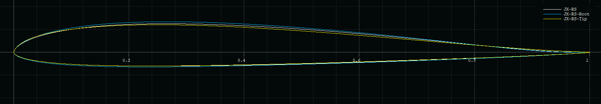

<!-- PROJECT LOGO -->

# JX-RS
Airfoil family for fast running flying wings with a reflexed chord line.

### Description

The airfoils were designed using [Xoptfoil-JX](https://github.com/jxjo/Xoptfoil-JX/) with the focus on performance in a cl range of 0.1 to 0.5 while maintaining a good positive moment. 

The airfoil family allows to design a complete wing typically in a span range of 1.8m-2.8m. A major design concept is, that the root airfoil (with a deeper chord) contributes more to the positve moment of the complete wing than the airfoil towards the tip.

| Airfoil      | Thickness       | Camber         | Re*Sqrt(cl) |  Moment cm  |
| :---         |     :---        |   :---         |  ---:       |  :---:      |
| JX-RS-Root   | 7.90% at 25.4%  | 1.40% at 28.6% |  120k       |   higher    |
| JX-RS        | 7.40% at 25.9%  | 1.30% at 27.5% |   75k       |   medium    |
| JX-RS-Tip    | 7.20% at 24.3%  | 1.22% at 26.4% |   40k       |   low       |

### Calculation of Re*Sqrt(cl)
The value of Re*Sqrt(cl), which equals to the fixed lift T2 polar, can be easly calculated with the approximation formula

`Re*Sqrt(cl) = 900 * l * sqrt(Ws)` with `l  chord length [cm]` and `Ws wing load    [g/dm²]`

Example: 
A wing with a wing load of 70 g/dm² will have at chord length 20cm a value of:
Re*sqrt(cl) = 900 * 20 * sqrt(70) = 150000.
So airfoil JX-GS-15 would be a good choice at this section.  

### License
Unless otherwise noted, these files are licensed under the Creative Commons [Attribution-ShareAlike 4.0 International](https://creativecommons.org/licenses/by-sa/4.0/) (CC BY-SA 4.0) license.

