<!-- PROJECT LOGO -->
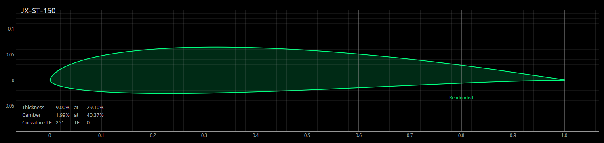

# JX-ST

The JX-ST airfoil family (or 'strak') focuses on speed-oriented, dynamic flying for wings with a higher wing loading and a higher aspect ratio, which is typically found in scale-like gliders.

The strak can be applied to wings having a wing span from 3m to 6m and a wing load of 60 - 80g/dm². When used at the right wing sections, a harmonious distribution of lift, drag and moment will be achieved.
 
Flaps are recommended to achieve optimal glide ratio, thermaling performance and overall best results.

All airfoils were generated by [Xoptfoil2](https://github.com/jxjo/Xoptfoil2) as the airfoil optimizer, with [AirfoilEditor](https://github.com/jxjo/AirfoilEditor) serving as the workbench. 

## In Short

#### Characteristics 

Main aerodynamic characteristics of JX-ST are …

- optimized lower Reynolds properties supporting good acceleration 
- low minimum drag at about cl=0.2 
- optimized drag toward cl=0.0 for fine high-speed performance
- balanced maximum glide ratio and alpha_max

Wings based on JX-ST show …

- good acceleration for dynamic flight maneuvers
- high maximum speed
- well-behaved flight properties
- with flaps set, good slow flight and thermal capabilities 

#### Airfoil Family  

The four airfoils of the family scaled to their size in wing sections:

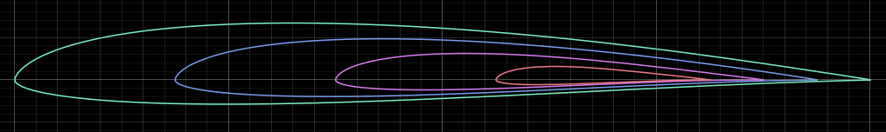

Main geometric properties:

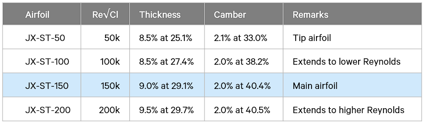

---

#### About This Document

This document serves two purposes:

*For wing designers:* The Summary and Usage sections provide everything needed to select and apply the JX-ST airfoils to your project. The formula and tables give you the practical tools to determine which airfoils to use where.

*For those interested in the development process:* The Airfoil Design and Optimization sections explain the aerodynamic considerations and methodology used to create these airfoils. These sections assume familiarity with airfoil aerodynamics and polar diagrams.

---

## Airfoil Design 

This chapter describes the design approach and aerodynamic considerations for the JX-ST airfoil family. It explains how the flight envelope was defined, why specific design decisions were made, and how the optimization process balanced conflicting aerodynamic requirements.

### Flight Envelope 

The first step is to define the Reynolds number and lift coefficient range in which the airfoil will primarily operate.
The following parameters are determined:
 - Re·√Cl, which corresponds to the Type 2 polar (constant lift polar) - static flight
 - Reynolds number range in which the airfoil will be operated dynamically
 - Lift coefficient range in which the airfoil will primarily operate

#### Determine Re·√Cl

The airfoil primarily targets wings with a higher wing loading of 60-80 g/dm² and a higher aspect ratio with a root chord of 180-230 mm. 
With these initial parameters, the value of Re·√Cl is determined, which characterizes the constant lift polar (Type 2 polar).

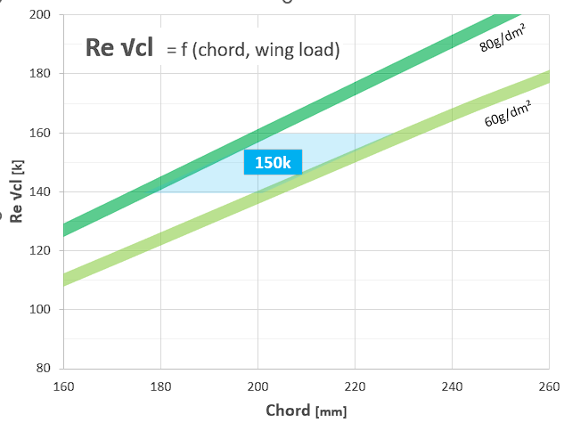

The value of Re·√Cl can also be easily calculated using the approximation formula:

`Re·√Cl = 900 · l · √Ws` where `l` = chord [cm], `Ws` = wing load [g/dm²]

For the new airfoil family the main airfoil will be designed for Re·√Cl = 150,000 and named **JX-ST-150**.

#### Re Number and Lift Coefficient

Based on a chord of 200 mm, the Reynolds numbers can be calculated assuming typical flight speeds.
The corresponding flight lift coefficient Cl can be derived from Re√Cl = 150k, which was determined in the previous step. 

| Speed   | Reynolds  | Cl    |  Remarks     
| :---    |   :---    |  :--- | :---      |
| 15 m/s  | 200k      | 0.56  | Relaxed gliding at mid-high lift coefficient    |
| 45 m/s  | 600k      | 0.06  | High-speed flight at very low lift coefficient |

These operating conditions form the basis for the airfoil optimization described below. The primary optimization uses a Type 1 polar (constant speed) at Re=600k, while an additional Type 1 polar at Re=200k ensures good performance characteristics at lower speeds.

### Dynamic Flight

Dynamic flying - diving, accelerating, and pulling out - creates specific challenges for airfoil performance. The diagram below illustrates a simple acceleration maneuver: the glider dives from altitude and exits at high speed. The overlaid polar diagram shows this same maneuver as a path through the drag polar.

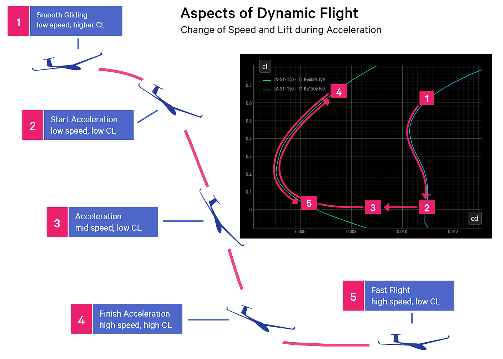

Challenge for Airfoil Design: At the start of acceleration (point 2), the airfoil must work at low Reynolds numbers AND very low lift coefficients - a difficult combination. While designed for high Reynolds numbers at low Cl, it experiences flow separation and high drag in this condition, resisting acceleration.

Solution Approach: Optimize the airfoil to maintain acceptable drag at this critical combination of low Reynolds numbers and low Cl values. This allows the glider to accelerate smoothly rather than "punching through" a drag barrier.

During the pullout (point 4), the airfoil operates at a high, constant Reynolds number while Cl transitions from very low through high values and back - a less critical regime that most airfoils handle well.

### Base Airfoil JX-GT3-100

The optimization process doesn't start from scratch but rather uses an existing airfoil that already possesses good fundamental aerodynamic properties for our task. 

In this case, the [JX-GT3-100 airfoil](https://github.com/jxjo/Airfoils/tree/main/JX-GT) serves as the starting point, featuring a thickness of 7.7% and camber of 1.7%. 

As the JX-GT3-100 is designed for a lower wing load range of 40-70g/dm², the base airfoil's camber is increased to 2% to accommodate the higher wing loading of 60-80g/dm².

*Note:* While the higher camber reduces performance slightly at very high speeds, it contributes to balanced characteristics for gliding and thermal soaring. For the airfoil without deployed flaps, this represents a deliberate compromise between the competing requirements of high-speed flight and thermal performance.

### Thickness Considerations

A common assumption is that thinner airfoils are faster. However, for dynamic flying with rapid speed changes, this is not always true. The analysis below compares the same airfoil at three different thickness ratios (7%, 9%, and 11%) while maintaining constant camber of 2%.

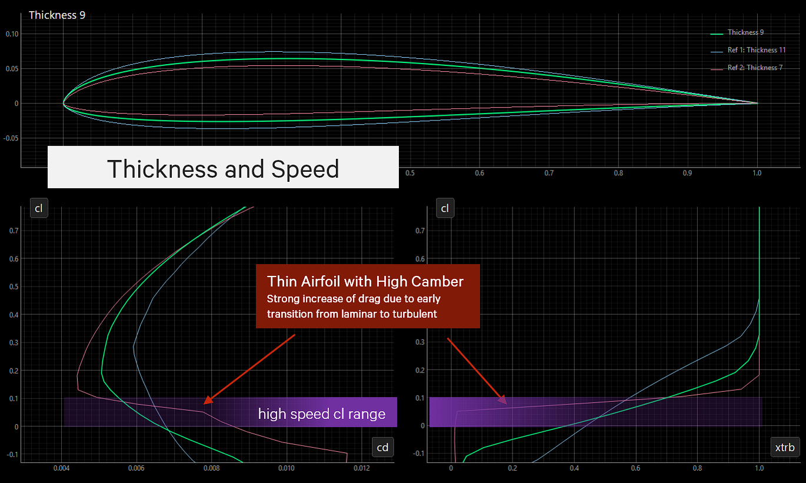

The 7% airfoil exhibits excellent minimum drag at approximately cl=0.15, but experiences a sharp drag increase at lift coefficients below cl=0.1. This means it performs well at moderate speeds but suffers from excessive drag during sustained high-speed flight.

Explanation: At this thickness combined with higher camber, the lower surface lacks sufficient "belly". At negative angles of attack, this causes the flow to decelerate too rapidly, triggering premature laminar-to-turbulent transition.

The 9% airfoil shows slightly higher minimum drag, but maintains significantly lower drag at cl<0.1. In practice, this means better sustained high-speed flight performance.

The 11% airfoil raises drag across the entire lift coefficient range without providing aerodynamic benefits.

**Conclusion:** An airfoil that is too thin is counterproductive for high-speed flight. The guiding principle: as thick as necessary, as thin as possible. 

Further investigations showed that 9% thickness for the main airfoil provides a good compromise between aerodynamic performance and structural requirements.

While constructing a high aspect ratio wing with an airfoil of just 9% thickness presents structural challenges, modern composite materials (carbon fiber) should make this readily achievable with adequate strength and stiffness.

### Reference Airfoil SA7036 modified

To benchmark the performance of the new airfoil, the well-established SA7036 airfoil was selected as a reference. Like the JX-GT3-100 base airfoil, it was modified to 9% thickness and 2% camber for direct comparison.

The analysis revealed that the modified SA7036 already approaches the performance targets, with only minor improvements achievable:
- The SA7036 is optimized for higher Reynolds numbers, resulting in weaker performance at lower Reynolds numbers (see section "Dynamic Flight")
- The polar curve shows slight irregularities in the higher cl range, and the maximum angle of attack (alpha_max) could be increased
- High-speed flight characteristics offer some room for improvement

Geometrically, the two modified airfoils JX-GT3-100 and SA7036 exhibit very similar shapes...

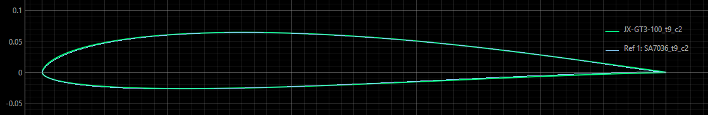

## Airfoil Optimization

Airfoil design and optimization is performed using [Xoptfoil2](https://github.com/jxjo/Xoptfoil2), which is integrated into the [AirfoilEditor](https://github.com/jxjo/AirfoilEditor) environment. The optimization modifies the shape of the base airfoil according to the defined optimization objectives.

### Shape Function and Geometric Aspects 

The airfoil geometry is represented by two Bezier curves, one for the upper and one for the lower surface, each defined by 7 control points.

The first and last control points of the Bezier curve are fixed, defining the leading edge (LE) and trailing edge (TE). The second control point defines the perpendicular starting tangent at the leading edge. This parameterization results in 9 design variables per Bezier curve that are subject to optimization. 
An additional constraint is applied at the leading edge, where the curvature of both Bezier curves must be equal to achieve C2 continuity (smooth curvature transition).

On the lower surface, the curvature is contrained to have one reversal, resulting in a so-called rear-loaded airfoil with a concave surface toward the trailing edge.

The desired thickness of 9% will be part of the optimization targets.

### Operating Conditions 

The optimization objectives are defined on a Type 1 polar (constant speed) at Re=600k. 
To ensure the required good acceleration characteristics, an additional Type 1 polar at Re=200k is evaluated.

A value of ncrit=9 is applied, representing a moderate turbulence level.

### Operating Points 

The optimization objectives are defined by operating points, each specifying a target value for aerodynamic parameters such as drag coefficient (cd) that the optimizer should achieve.
Since Bezier curves are inherently smooth, no additional operating points are required to prevent surface bumps or artifacts in the final airfoil.

The following diagram shows the final airfoil design of the optimization together with the target operating points and the resulting polars. 

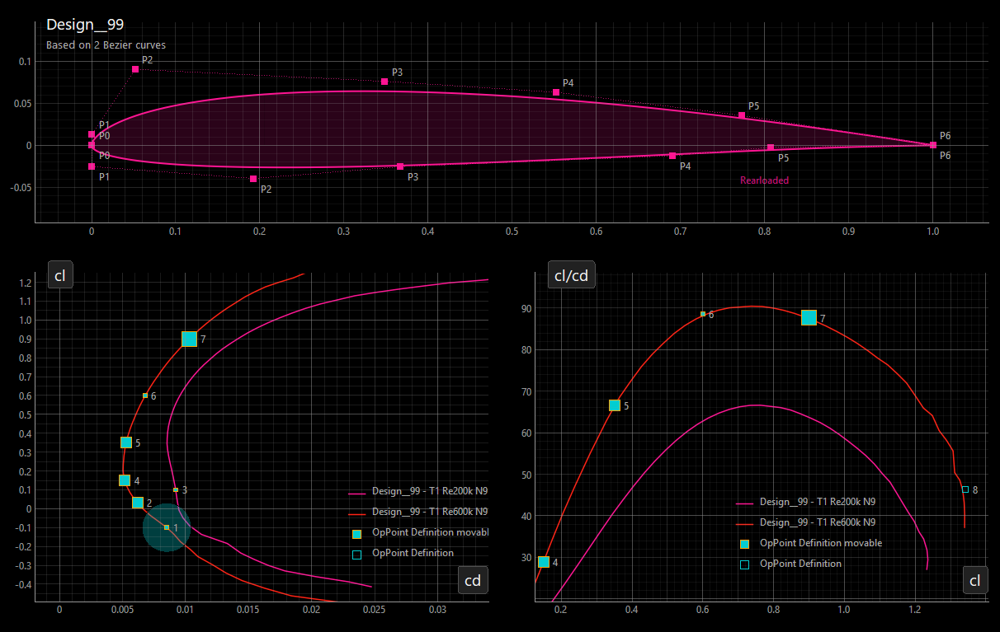

To illustrate how the optimization objectives are defined, the following describes the role of each operating point and how they interact with each other:

**op 1:** Helper point to achieve low cd at negative cl under the regime of the main targets

**op 2:** Controls cd close to cl=0 (high speed flight). As this target requires late laminar-turbulent transition on the lower surface, this point conflicts with operating points 5 and 6, which favor significant rear-loading that limits the laminar run length.

**op 3:** Helper point at Re=200k to limit drag increase through laminar separation bubbles at lower cl (needed for good acceleration)

**op 4:** Ensures minimum cd, which is primarily determined by the thickness target of 9%.

**op 5:** Together with 'op 6' defines the glide ratio. The counterparts are 'op 3' (at Re=200k) which wants to have a more bubble ramp upper surface and 'op 2' which limits rear loading of the lower surface.

**op 6:** Helper point to control the shape of the polar close to maximum glide

**op 7:** Determines max glide ratio. Claims more camber which is limited by 'op 2'

**op 8:** Defines maximum angle of attack and maximum cl. Claims more camber and a large leading edge radius to reduce leading-edge suction peak. This conflicts with minimized cd at low cl.

The airfoil optimization process requires several iterations to find a good balance between the conflicting operating points.
To achieve this balance, each operating point can be assigned an individual weighting within the objective function, or its target value can be relaxed to be less stringent.

### Airfoil Family

After the development of the main airfoil JX-ST-150 was completed, two additional airfoils were developed following the same methodology. These airfoils possess similar aerodynamic characteristics but are designed for different Reynolds number ranges:

**JX-ST-100** for Re√Cl=100, optimized at Re=400k.  
**JX-ST-200** for Re√Cl=200, optimized at Re=800k.  

The three airfoils share a nearly identical alpha_max and cl_max, which enables the design of wings with a nearly elliptical lift distribution and sufficient lift reserves.

The fourth airfoil plays a special role, as it was designed for the wing tip:

**JX-ST-50** for Re√Cl=50, optimized at Re=200k.

This airfoil was optimized less for best aerodynamic performance and more for maintaining good alpha_max at the low Reynolds numbers found at the wing tip.

With this fourth airfoil, the JX-ST airfoil family is complete:

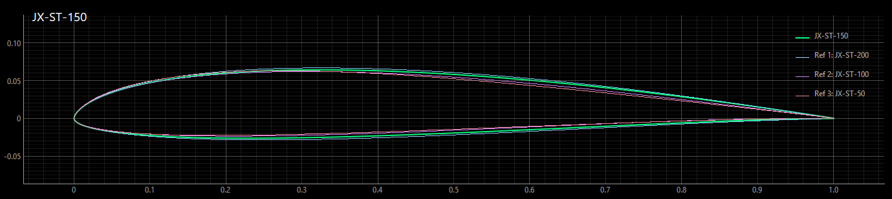

## Aerodynamic Properties

### Main Airfoil JX-ST-150 

The improvements of the new JX-ST-150 airfoil compared to the modified JX-GT-100 and the modified SA7036 are, as expected, quite modest. Both reference airfoils already possess excellent aerodynamic properties that are close to the physical limits as represented by Xfoil.

Compared to the modified SA7036, the new airfoil has slightly improved high-speed flight characteristics (cl < 0.2), a higher alpha_max, and a smaller drag hump caused by laminar separation bubbles at low Reynolds numbers.

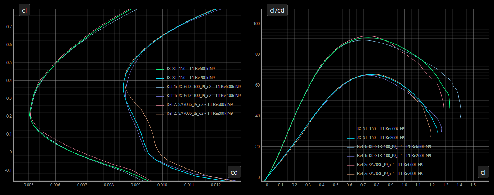

### Airfoil Family JX-ST

While each airfoil in the JX-ST family performs well individually, the real benefit comes from using them together as a matched set across the wing span.

The polar diagrams below show the four airfoils at their design Reynolds numbers. The three main airfoils (JX-ST-200, -150, and -100) share similar characteristics - similar drag buckets, comparable glide ratios, and nearly identical stall behavior. This consistency creates a harmonious lift distribution along the wing with no sudden changes in local flow conditions.

The tip airfoil JX-ST-50 maintains adequate performance even at low Reynolds numbers, ensuring the wing tip behaves predictably during all flight phases.

High-speed flight (at design Reynolds number of each airfoil):

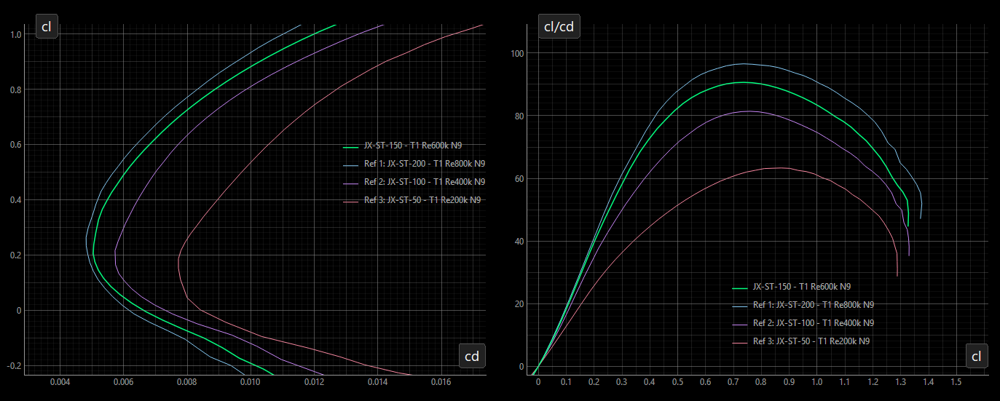

Slow flight (approximately one-third of design Reynolds numbers):

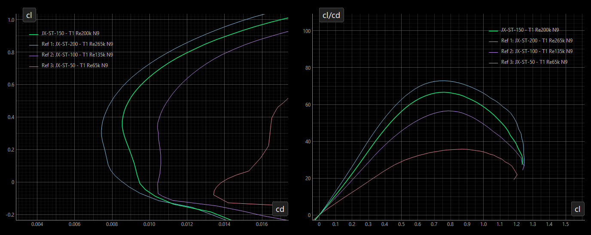

---

## Usage

### Selecting the Right Airfoils

#### 1: Determine root airfoil

Calculate Re√Cl at the wing root using:

`Re·√Cl = 900 · l · √Ws` where `l` = chord [cm], `Ws` = wing load [g/dm²]

Example: A wing with 70 g/dm² wing loading and 20 cm root chord:
- Re·√Cl = 900 × 20 × √70 = 150,000
- Root airfoil: JX-ST-150

#### 2: Select the mid-span airfoil

At approximately 60% of root chord depth along the span, use the airfoil corresponding to 60% of the root Re√Cl value.
- For JX-ST-170 root: 0.6 × 170 = 102 → use JX-ST-100
- For JX-ST-150 root: 0.6 × 150 = 90 → use JX-ST-90

#### 3: Use JX-ST-50 at the wing tip

These three airfoils (root, mid-span, tip) provide an aerodynamically sound wing design.

#### Optional: Add intermediate airfoils

For structural or aerodynamic refinement, intermediate blended airfoils are available in steps of Re√Cl = 10k in the [blended](blended) directory.

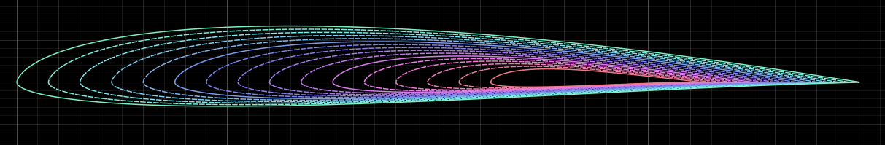

### Installation

Download the zip-file [JX-ST.zip](JX-ST.zip) including the four main airfoils, all blended airfoils as described  and this README as pdf.

### License
Unless otherwise noted, these files are licensed under the Creative Commons [Attribution-ShareAlike 4.0 International](https://creativecommons.org/licenses/by-sa/4.0/) (CC BY-SA 4.0) license.

